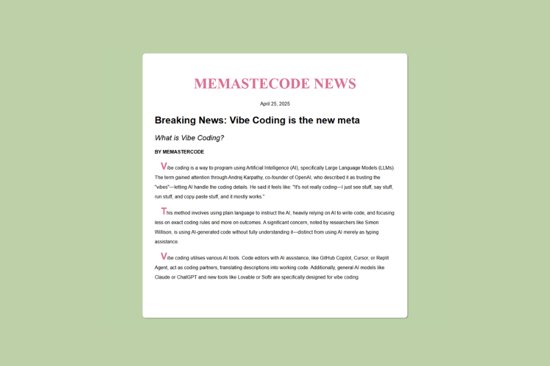

# Artículo de Periódico 📰

Este proyecto consiste en la creación de una página de artículo de periódico utilizando HTML y CSS. Forma parte de un laboratorio práctico para mejorar habilidades en el uso de tipografías y estilos de texto.

## 🎯 Objetivo
- Construir la estructura de un artículo de periódico.
- Aplicar estilos de fuentes utilizando propiedades como:
  - `font-family`
  - `font-size`
  - `font-weight`
  - Entre otros.

## ✨ Características
- Encabezados, subtítulos y cuerpo de texto estilizados.
- Diseño sencillo y organizado similar a un periódico tradicional.
- Enfoque en la correcta jerarquía visual de los textos.

## 🛠️ Tecnologías utilizadas
- HTML
- CSS

## 🚀 Cómo usar
1. Clona este repositorio:
   ```bash
   git clone https://github.com/Mershar0/newspaperArticle.git
2. Abre el archivo index.html en tu navegador.

## 📸 Vista previa
<p align="center">
  
</p>


## 👤 Autor
Mershar0
